# Common Platform Product Management Service

## Table of Contents

- [Overview](#overview)
- [Features](#features)
- [Architecture](#architecture)
  - [Modules](#modules)
  - [Technology Stack](#technology-stack)
- [Entity Relationship Diagram](#entity-relationship-diagram)
- [API Usage Overview](#api-usage-overview)
  - [Products API](#products-api)
  - [Product Categories API](#product-categories-api)
  - [Product Configurations API](#product-configurations-api)
  - [Product Versions API](#product-versions-api)
  - [Product Relationships API](#product-relationships-api)
  - [Product Localizations API](#product-localizations-api)
  - [Product Documentation API](#product-documentation-api)
  - [Product Documentation Requirements API](#product-documentation-requirements-api)
- [FilterRequest and PaginationResponse](#filterrequest-and-paginationresponse)
- [Quickstart](#quickstart)
  - [Prerequisites](#prerequisites)
  - [Local Development Setup](#local-development-setup)
  - [Docker Deployment](#docker-deployment)
- [Configuration](#configuration)
- [Development Guidelines](#development-guidelines)
  - [Code Style](#code-style)
  - [Testing](#testing)
  - [Branching Strategy](#branching-strategy)
- [Continuous Integration](#continuous-integration)
- [Deployment](#deployment)
- [Contributing](#contributing)

## Overview

The Common Platform Product Management Service is a mission-critical enterprise microservice component of the Firefly CoreBanking platform. It serves as the authoritative centralized repository for all product information across the Firefly ecosystem, providing a single source of truth for product data with multi-tenancy support.

### Key Capabilities

- **Multi-Tenant Product Catalog**: Maintains a comprehensive inventory of all financial products with tenant isolation via `tenantId`
- **Hierarchical Categorization**: Supports parent-child category relationships with automatic level calculation
- **Flexible Configuration**: Key-value configuration system supporting PRICING, LIMITS, FEATURES, and CUSTOM types
- **Product Versioning**: Track product versions with immutable change history
- **Global Localization**: Multi-language product descriptions and region-specific variations
- **Relationship Mapping**: Define relationships between products for cross-selling and upselling
- **Documentation Management**: Manage product documentation and contracting requirements

The service is built using a reactive programming model with Spring WebFlux and Spring Data R2DBC, ensuring enterprise-grade performance and horizontal scalability.

## Features

- **Multi-Tenancy Support**: Each product is associated with a tenant via `tenantId` for platform isolation
- **Hierarchical Product Categorization**: Multi-level category taxonomy with parent-child relationships
- **Key-Value Configuration**: Flexible product configuration with typed categories (PRICING, LIMITS, FEATURES, CUSTOM)
- **Product Versioning**: Track and manage different versions of products
- **Product Relationships**: Define PRE_REQUISITE, COMPLIMENTARY, UPGRADE, and CROSS_SELL relationships
- **Global Localization**: Support for product information in multiple languages
- **Documentation Management**: Manage product documentation (TNC, BROCHURE, POLICY_DOC)
- **Contracting Requirements**: Define required documentation for product contracting/opening phases

## Architecture

The service follows a domain-driven, hexagonal architecture with clear separation of concerns:

### Modules

| Module | Description |
|--------|-------------|
| **common-platform-product-mgmt-core** | Business logic, service implementations, and MapStruct mappers |
| **common-platform-product-mgmt-interfaces** | DTOs, interfaces, and enums for API contracts |
| **common-platform-product-mgmt-models** | Database entities, R2DBC repositories, and Flyway migrations |
| **common-platform-product-mgmt-web** | REST controllers with reactive endpoints |
| **common-platform-product-mgmt-sdk** | OpenAPI specification and generated SDK |

### Technology Stack

| Technology | Purpose |
|------------|---------|
| **Java 21** | Programming language with modern features |
| **Spring Boot 3.x** | Application framework |
| **Spring WebFlux** | Reactive web framework (Mono/Flux) |
| **Spring Data R2DBC** | Reactive database access |
| **PostgreSQL** | Relational database |
| **Flyway** | Database migrations |
| **MapStruct** | Entity-to-DTO mapping with `updateEntityFromDto()` |
| **Lombok** | Boilerplate reduction (`@RequiredArgsConstructor`, `@Data`) |
| **OpenAPI/Swagger** | API documentation |
| **Maven** | Build and dependency management |
| **Docker** | Containerization |

### Controller Patterns

All controllers follow these patterns:
- `@RestController` with `@RequestMapping` for base path
- `@RequiredArgsConstructor` for constructor injection
- `@Validated` for request validation
- `@Valid @RequestBody` for request body validation
- `POST /filter` endpoints with `FilterRequest<DTO>` for filtering/pagination
- Reactive return types: `Mono<ResponseEntity<T>>` or `Flux<T>`

### Service Layer Patterns

- Services use `FilterRequest<DTO>` and `FilterUtils` for filtering and pagination
- MapStruct mappers with `toDto()`, `toEntity()`, and `updateEntityFromDto()` methods
- Parent entity validation for all child entity operations

## Entity Relationship Diagram

```mermaid
erDiagram
    PRODUCT ||--o{ PRODUCT_VERSION : has
    PRODUCT ||--o{ PRODUCT_RELATIONSHIP : has
    PRODUCT ||--o{ PRODUCT_LOCALIZATION : has
    PRODUCT ||--o{ PRODUCT_DOCUMENTATION : has
    PRODUCT ||--o{ PRODUCT_DOCUMENTATION_REQUIREMENT : has
    PRODUCT ||--o{ PRODUCT_CONFIGURATION : has
    PRODUCT }o--|| PRODUCT_CATEGORY : belongs_to
    PRODUCT_CATEGORY ||--o{ PRODUCT_CATEGORY : has_children

    PRODUCT {
        UUID productId PK
        UUID tenantId FK "Multi-tenancy support"
        UUID productCategoryId FK
        ProductTypeEnum productType "FINANCIAL, NON_FINANCIAL"
        String productName
        String productCode
        String productDescription
        ProductStatusEnum productStatus "PROPOSED, ACTIVE, RETIRED, DRAFT"
        LocalDate launchDate
        LocalDate endDate
        LocalDateTime dateCreated
        LocalDateTime dateUpdated
    }

    PRODUCT_CATEGORY {
        UUID productCategoryId PK
        String categoryName
        String categoryDescription
        UUID parentCategoryId FK "Self-referencing for hierarchy"
        Integer level "Auto-calculated: 0 for root, parent.level + 1 for children"
        LocalDateTime dateCreated
        LocalDateTime dateUpdated
    }

    PRODUCT_CONFIGURATION {
        UUID productConfigurationId PK
        UUID productId FK
        ProductConfigTypeEnum configType "PRICING, LIMITS, FEATURES, CUSTOM"
        String configKey
        String configValue
        LocalDateTime dateCreated
        LocalDateTime dateUpdated
    }

    PRODUCT_VERSION {
        UUID productVersionId PK
        UUID productId FK
        Long versionNumber
        String versionDescription
        LocalDateTime effectiveDate
        LocalDateTime dateCreated
        LocalDateTime dateUpdated
    }

    PRODUCT_RELATIONSHIP {
        UUID productRelationshipId PK
        UUID productId FK
        UUID relatedProductId FK
        RelationshipTypeEnum relationshipType "PRE_REQUISITE, COMPLIMENTARY, UPGRADE, CROSS_SELL"
        String description
        LocalDateTime dateCreated
        LocalDateTime dateUpdated
    }

    PRODUCT_LOCALIZATION {
        UUID productLocalizationId PK
        UUID productId FK
        String languageCode
        String localizedName
        String localizedDescription
        LocalDateTime dateCreated
        LocalDateTime dateUpdated
    }

    PRODUCT_DOCUMENTATION {
        UUID productDocumentationId PK
        UUID productId FK
        DocTypeEnum docType "TNC, BROCHURE, POLICY_DOC"
        Long documentManagerRef
        LocalDateTime dateAdded
        LocalDateTime dateCreated
        LocalDateTime dateUpdated
    }

    PRODUCT_DOCUMENTATION_REQUIREMENT {
        UUID productDocRequirementId PK
        UUID productId FK
        ContractingDocTypeEnum docType "IDENTIFICATION, TAX_IDENTIFICATION, PROOF_OF_ADDRESS, etc."
        Boolean isMandatory
        String description
        LocalDateTime dateCreated
        LocalDateTime dateUpdated
    }
```



## API Usage Overview

All filter endpoints use `POST` with `FilterRequest<DTO>` in the request body. This provides flexible filtering, sorting, and pagination capabilities.

### Products API

Base path: `/api/v1/products`

| Method | Endpoint | Description | Request Body | Response |
|--------|----------|-------------|--------------|----------|
| `POST` | `/filter` | Filter products with pagination | `FilterRequest<ProductDTO>` | `PaginationResponse<ProductDTO>` |
| `POST` | `/` | Create a new product | `ProductDTO` | `ProductDTO` (201) |
| `GET` | `/{productId}` | Get product by ID | - | `ProductDTO` |
| `PUT` | `/{productId}` | Update product | `ProductDTO` | `ProductDTO` |
| `DELETE` | `/{productId}` | Delete product | - | 204 No Content |

**ProductDTO Fields:**
```json
{
  "productId": "UUID (read-only)",
  "tenantId": "UUID (required)",
  "productCategoryId": "UUID",
  "productType": "FINANCIAL | NON_FINANCIAL",
  "productName": "string",
  "productCode": "string",
  "productDescription": "string",
  "productStatus": "PROPOSED | ACTIVE | RETIRED | DRAFT",
  "launchDate": "LocalDate",
  "endDate": "LocalDate",
  "dateCreated": "LocalDateTime (read-only)",
  "dateUpdated": "LocalDateTime (read-only)"
}
```

### Product Categories API

Base path: `/api/v1/categories`

| Method | Endpoint | Description | Request Body | Response |
|--------|----------|-------------|--------------|----------|
| `POST` | `/filter` | Filter root categories | `FilterRequest<ProductCategoryDTO>` | `PaginationResponse<ProductCategoryDTO>` |
| `POST` | `/` | Create a new category | `ProductCategoryDTO` | `ProductCategoryDTO` (201) |
| `GET` | `/{categoryId}` | Get category by ID | - | `ProductCategoryDTO` |
| `PUT` | `/{categoryId}` | Update category | `ProductCategoryDTO` | `ProductCategoryDTO` |
| `DELETE` | `/{categoryId}` | Delete category | - | 204 No Content |

**ProductCategoryDTO Fields:**
```json
{
  "productCategoryId": "UUID (read-only)",
  "categoryName": "string",
  "categoryDescription": "string",
  "parentCategoryId": "UUID (null for root categories)",
  "level": "Integer (read-only, auto-calculated)",
  "dateCreated": "LocalDateTime (read-only)",
  "dateUpdated": "LocalDateTime (read-only)"
}
```

### Product Configurations API

Base path: `/api/v1/products/{productId}/configurations`

| Method | Endpoint | Description | Request Body | Response |
|--------|----------|-------------|--------------|----------|
| `POST` | `/filter` | Filter configurations | `FilterRequest<ProductConfigurationDTO>` | `PaginationResponse<ProductConfigurationDTO>` |
| `POST` | `/` | Create configuration | `ProductConfigurationDTO` | `ProductConfigurationDTO` (201) |
| `GET` | `/{configId}` | Get by ID | - | `ProductConfigurationDTO` |
| `GET` | `/by-key/{configKey}` | Get by key | - | `ProductConfigurationDTO` |
| `GET` | `/by-type/{configType}` | Get all by type | - | `Flux<ProductConfigurationDTO>` |
| `PUT` | `/{configId}` | Update configuration | `ProductConfigurationDTO` | `ProductConfigurationDTO` |
| `DELETE` | `/{configId}` | Delete configuration | - | 204 No Content |

**ProductConfigurationDTO Fields:**
```json
{
  "productConfigurationId": "UUID (read-only)",
  "productId": "UUID",
  "configType": "PRICING | LIMITS | FEATURES | CUSTOM",
  "configKey": "string",
  "configValue": "string",
  "dateCreated": "LocalDateTime (read-only)",
  "dateUpdated": "LocalDateTime (read-only)"
}
```

### Product Versions API

Base path: `/api/v1/products/{productId}/versions`

| Method | Endpoint | Description | Request Body | Response |
|--------|----------|-------------|--------------|----------|
| `POST` | `/filter` | Filter versions | `FilterRequest<ProductVersionDTO>` | `PaginationResponse<ProductVersionDTO>` |
| `POST` | `/` | Create version | `ProductVersionDTO` | `ProductVersionDTO` (201) |
| `GET` | `/{versionId}` | Get by ID | - | `ProductVersionDTO` |
| `PUT` | `/{versionId}` | Update version | `ProductVersionDTO` | `ProductVersionDTO` |
| `DELETE` | `/{versionId}` | Delete version | - | 204 No Content |

**ProductVersionDTO Fields:**
```json
{
  "productVersionId": "UUID (read-only)",
  "productId": "UUID",
  "versionNumber": "Long",
  "versionDescription": "string",
  "effectiveDate": "LocalDateTime",
  "dateCreated": "LocalDateTime (read-only)",
  "dateUpdated": "LocalDateTime (read-only)"
}
```

### Product Relationships API

Base path: `/api/v1/products/{productId}/relationships`

| Method | Endpoint | Description | Request Body | Response |
|--------|----------|-------------|--------------|----------|
| `POST` | `/filter` | Filter relationships | `FilterRequest<ProductRelationshipDTO>` | `PaginationResponse<ProductRelationshipDTO>` |
| `POST` | `/` | Create relationship | `ProductRelationshipDTO` | `ProductRelationshipDTO` (201) |
| `GET` | `/{relationshipId}` | Get by ID | - | `ProductRelationshipDTO` |
| `PUT` | `/{relationshipId}` | Update relationship | `ProductRelationshipDTO` | `ProductRelationshipDTO` |
| `DELETE` | `/{relationshipId}` | Delete relationship | - | 204 No Content |

**ProductRelationshipDTO Fields:**
```json
{
  "productRelationshipId": "UUID (read-only)",
  "productId": "UUID",
  "relatedProductId": "UUID",
  "relationshipType": "PRE_REQUISITE | COMPLIMENTARY | UPGRADE | CROSS_SELL",
  "description": "string",
  "dateCreated": "LocalDateTime (read-only)",
  "dateUpdated": "LocalDateTime (read-only)"
}
```

### Product Localizations API

Base path: `/api/v1/products/{productId}/localizations`

| Method | Endpoint | Description | Request Body | Response |
|--------|----------|-------------|--------------|----------|
| `POST` | `/filter` | Filter localizations | `FilterRequest<ProductLocalizationDTO>` | `PaginationResponse<ProductLocalizationDTO>` |
| `POST` | `/` | Create localization | `ProductLocalizationDTO` | `ProductLocalizationDTO` (201) |
| `GET` | `/{localizationId}` | Get by ID | - | `ProductLocalizationDTO` |
| `PUT` | `/{localizationId}` | Update localization | `ProductLocalizationDTO` | `ProductLocalizationDTO` |
| `DELETE` | `/{localizationId}` | Delete localization | - | 204 No Content |

**ProductLocalizationDTO Fields:**
```json
{
  "productLocalizationId": "UUID (read-only)",
  "productId": "UUID",
  "languageCode": "string (e.g., 'en', 'es', 'fr')",
  "localizedName": "string",
  "localizedDescription": "string",
  "dateCreated": "LocalDateTime (read-only)",
  "dateUpdated": "LocalDateTime (read-only)"
}
```

### Product Documentation API

Base path: `/api/v1/products/{productId}/documentation`

| Method | Endpoint | Description | Request Body | Response |
|--------|----------|-------------|--------------|----------|
| `POST` | `/filter` | Filter documentation | `FilterRequest<ProductDocumentationDTO>` | `PaginationResponse<ProductDocumentationDTO>` |
| `POST` | `/` | Create documentation | `ProductDocumentationDTO` | `ProductDocumentationDTO` (201) |
| `GET` | `/{docId}` | Get by ID | - | `ProductDocumentationDTO` |
| `PUT` | `/{docId}` | Update documentation | `ProductDocumentationDTO` | `ProductDocumentationDTO` |
| `DELETE` | `/{docId}` | Delete documentation | - | 204 No Content |

**ProductDocumentationDTO Fields:**
```json
{
  "productDocumentationId": "UUID (read-only)",
  "productId": "UUID",
  "docType": "TNC | BROCHURE | POLICY_DOC",
  "documentManagerRef": "Long",
  "dateAdded": "LocalDateTime",
  "dateCreated": "LocalDateTime (read-only)",
  "dateUpdated": "LocalDateTime (read-only)"
}
```

### Product Documentation Requirements API

Base path: `/api/v1/products/{productId}/documentation-requirements`

| Method | Endpoint | Description | Request Body | Response |
|--------|----------|-------------|--------------|----------|
| `POST` | `/filter` | Filter requirements | `FilterRequest<ProductDocumentationRequirementDTO>` | `PaginationResponse<ProductDocumentationRequirementDTO>` |
| `POST` | `/` | Create requirement | `ProductDocumentationRequirementDTO` | `ProductDocumentationRequirementDTO` (201) |
| `GET` | `/{requirementId}` | Get by ID | - | `ProductDocumentationRequirementDTO` |
| `GET` | `/by-type/{docType}` | Get by document type | - | `ProductDocumentationRequirementDTO` |
| `GET` | `/mandatory` | Get all mandatory | - | `Flux<ProductDocumentationRequirementDTO>` |
| `PUT` | `/{requirementId}` | Update requirement | `ProductDocumentationRequirementDTO` | `ProductDocumentationRequirementDTO` |
| `DELETE` | `/{requirementId}` | Delete requirement | - | 204 No Content |

**ProductDocumentationRequirementDTO Fields:**
```json
{
  "productDocRequirementId": "UUID (read-only)",
  "productId": "UUID",
  "docType": "IDENTIFICATION | TAX_IDENTIFICATION | PROOF_OF_ADDRESS | INCOME_VERIFICATION | BANK_STATEMENTS | POWER_OF_ATTORNEY | BUSINESS_REGISTRATION | ARTICLES_OF_INCORPORATION | COMPANY_BYLAWS | SIGNED_CONTRACT | REGULATORY_COMPLIANCE | CREDIT_REPORT | INSURANCE_POLICY | OTHER",
  "isMandatory": "Boolean",
  "description": "string",
  "dateCreated": "LocalDateTime (read-only)",
  "dateUpdated": "LocalDateTime (read-only)"
}
```

## FilterRequest and PaginationResponse

### FilterRequest Structure

All filter endpoints accept a `FilterRequest<DTO>` object:

```json
{
  "pageNumber": 0,
  "pageSize": 10,
  "sortBy": "dateCreated",
  "sortDirection": "DESC",
  "filters": {
    "fieldName": "value"
  }
}
```

**Example - Filter products by status:**
```bash
curl -X POST http://localhost:8080/api/v1/products/filter \
  -H "Content-Type: application/json" \
  -d '{
    "pageNumber": 0,
    "pageSize": 20,
    "sortBy": "productName",
    "sortDirection": "ASC",
    "filters": {
      "productStatus": "ACTIVE"
    }
  }'
```

### PaginationResponse Structure

All filter endpoints return a `PaginationResponse<DTO>`:

```json
{
  "content": [
    { /* DTO object */ },
    { /* DTO object */ }
  ],
  "pageNumber": 0,
  "pageSize": 20,
  "totalElements": 42,
  "totalPages": 3
}
```

## Quickstart

### Prerequisites

- **Java 21** or higher
- **Maven 3.8** or higher
- **PostgreSQL 14.x** or higher
- **Docker** (optional, for containerized deployment)

### Local Development Setup

1. **Clone the repository**:
   ```bash
   git clone https://github.com/firefly-oss/common-platform-product-mgmt.git
   cd common-platform-product-mgmt
   ```

2. **Configure database connection**:
   ```bash
   export DB_HOST=localhost
   export DB_PORT=5432
   export DB_NAME=product_mgmt
   export DB_USERNAME=postgres
   export DB_PASSWORD=postgres
   ```

3. **Build the project**:
   ```bash
   mvn clean install
   ```

4. **Run the application**:
   ```bash
   java -jar common-platform-product-mgmt-web/target/common-platform-product-mgmt.jar
   ```

5. **Access the API**:
   - Swagger UI: http://localhost:8080/swagger-ui.html
   - API Docs: http://localhost:8080/v3/api-docs
   - Health: http://localhost:8080/actuator/health

### Docker Deployment

1. **Build the Docker image**:
   ```bash
   docker build -t common-platform-product-mgmt:latest .
   ```

2. **Run the container**:
   ```bash
   docker run -p 8080:8080 \
     -e DB_HOST=host.docker.internal \
     -e DB_PORT=5432 \
     -e DB_NAME=product_mgmt \
     -e DB_USERNAME=postgres \
     -e DB_PASSWORD=postgres \
     common-platform-product-mgmt:latest
   ```

## Configuration

The service uses Spring Boot's configuration framework with environment-specific profiles.

### Environment Variables

| Variable | Description | Default |
|----------|-------------|---------|
| `DB_HOST` | PostgreSQL host | `localhost` |
| `DB_PORT` | PostgreSQL port | `5432` |
| `DB_NAME` | Database name | `product_mgmt` |
| `DB_USERNAME` | Database username | `postgres` |
| `DB_PASSWORD` | Database password | `postgres` |
| `SPRING_PROFILES_ACTIVE` | Active Spring profile | `dev` |

### Configuration Files

- `application.yaml` - Base configuration
- `application-dev.yaml` - Development profile
- `application-prod.yaml` - Production profile

## Development Guidelines

### Code Style

- Follow Google Java Style Guide
- Use Lombok annotations (`@Data`, `@RequiredArgsConstructor`, `@Builder`)
- Use MapStruct for entity-to-DTO mapping
- Follow reactive patterns with `Mono` and `Flux`

### Testing

Run all tests:
```bash
mvn test
```

Run specific test class:
```bash
mvn test -Dtest=ProductServiceImplTest
```

### Branching Strategy

- **main**: Production-ready code
- **develop**: Integration branch
- **feature/{ticket-id}-{description}**: Feature branches
- **hotfix/{ticket-id}-{description}**: Emergency fixes

## Continuous Integration

The project uses GitHub Actions for CI/CD:
- Build and compile
- Run unit tests
- Build Docker images
- Publish to container registry

## Deployment

| Environment | Branch | Description |
|-------------|--------|-------------|
| Development | `develop` | Development environment |
| Production | `main` | Production environment |

## Contributing

1. Create a feature branch from `develop`
2. Implement your changes
3. Write or update tests
4. Submit a pull request to `develop`
5. Ensure CI checks pass
6. Request code review
